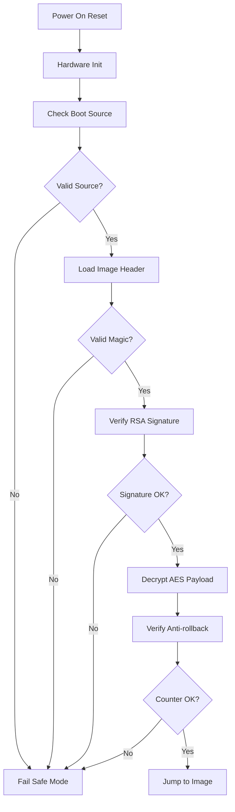

# BootROM Architecture Documentation

## Overview

The BootROM implements a secure boot solution for ARM Cortex-R5F based systems, providing authenticated and encrypted boot image loading with anti-rollback protection.

## System Architecture

### High-Level Components

```
┌─────────────────┐    ┌─────────────────┐    ┌─────────────────┐
│   BootROM       │    │   Signing Tool  │    │   Deployment    │
│   (Device)      │    │   (Host)        │    │   (Production)  │
├─────────────────┤    ├─────────────────┤    ├─────────────────┤
│ • Secure Boot   │    │ • RSA Signing   │    │ • Key Mgmt      │
│ • Crypto Verify │    │ • AES Encrypt   │    │ • Image Deploy  │
│ • Anti-rollback │    │ • Image Format  │    │ • Secure Update │
│ • Chain of Trust│    │ • Verification  │    │ • Monitoring    │
└─────────────────┘    └─────────────────┘    └─────────────────┘
```

### BootROM Internal Architecture

```
┌─────────────────────────────────────────────────────────────┐
│                    BootROM Memory Layout                    │
├─────────────────────────────────────────────────────────────┤
│ 0x00000000 - 0x0000FFFF │ BootROM Code (64KB ROM)           │
│ 0x20000000 - 0x20007FFF │ SRAM (32KB)                       │
│ 0x40000000 - 0x4FFFFFFF │ External Flash (256MB)            │
└─────────────────────────────────────────────────────────────┘
```

### Secure Boot Flow



## Key Components

### 1. Secure Boot Core (`secure_boot_core.c`)

**Responsibilities:**
- Image header parsing and validation
- RSA signature verification
- AES decryption of payload
- Anti-rollback counter checking
- Chain of trust establishment

**Key Functions:**
- `secure_boot_verify()`: Main verification entry point
- `verify_image_header()`: Header validation
- `verify_signature()`: RSA signature check
- `decrypt_payload()`: AES decryption
- `check_anti_rollback()`: Version checking

### 2. Crypto Wrapper (`crypto_wrapper.c`)

**Abstraction Layer:**
- Hardware-independent crypto operations
- MbedTLS integration
- Key management interface
- Error handling and logging

**Supported Algorithms:**
- RSA-2048 (PKCS#1 v1.5 signature)
- AES-256-CBC (payload encryption)
- SHA-256 (hashing)

### 3. Platform Layer (`platform.c`)

**Hardware Abstraction:**
- UART for debugging
- Flash memory interface
- Watchdog timer
- Reset cause detection
- Memory management

### 4. Signing Tool (`tools/boot_signer/`)

**Host-side Components:**
- Image builder (MbedTLS/OpenSSL backend)
- Key generation utilities
- Image format creation
- Verification testing

## Data Structures

### Image Header Format

```c
typedef struct {
    uint32_t magic;           // "MBRT" (0x5442524D)
    uint32_t version;         // Format version
    uint32_t image_size;      // Encrypted payload size
    uint32_t image_version;   // Anti-rollback version
    uint8_t  iv[16];          // AES IV
    uint8_t  signature[256];  // RSA signature
} image_header_t;
```

### Memory Layout

```
[Image Header (512 bytes)]
├── Magic (4 bytes)
├── Version (4 bytes)
├── Image Size (4 bytes)
├── Image Version (4 bytes)
├── AES IV (16 bytes)
└── RSA Signature (256 bytes)

[Encrypted Payload (variable)]
└── AES-256-CBC encrypted data with PKCS#7 padding
```

## Security Architecture

### Threat Model

**Attack Vectors Considered:**
1. **Image Tampering**: Modification of boot images
2. **Rollback Attacks**: Loading older, vulnerable firmware
3. **Key Compromise**: Exposure of signing keys
4. **Side Channel**: Timing/power analysis
5. **Fault Injection**: Glitching attacks

### Security Controls

**Implemented:**
- Cryptographic signature verification
- Symmetric encryption of payload
- Anti-rollback counters
- Secure key storage (OTP/eFuse)
- Chain of trust

**Recommended:**
- Secure boot measurements (PCR)
- Remote attestation
- Secure debug disable
- Tamper detection

## Performance Characteristics

### Boot Time Budget
- Total boot time: <500ms target
- Crypto operations: ~200ms (RSA verify + AES decrypt)
- Flash access: ~50ms
- Hardware init: ~50ms

### Memory Usage
- ROM footprint: ~45KB (BootROM code + MbedTLS)
- RAM usage: ~28KB (static allocation)
- Stack usage: ~4KB (worst case)

### Crypto Performance
- RSA-2048 verify: ~150ms (software)
- AES-256 decrypt: ~50ms (software)
- SHA-256 hash: ~10ms

## Platform Integration

### Supported Platforms
- ARM Cortex-R5F based SoCs
- External QSPI flash
- UART for debugging
- Watchdog timer

### Customization Points
- `platform_config.h`: Platform-specific settings
- `linker.ld`: Memory layout
- `mbedtls_config.h`: Crypto configuration
- `crypto_wrapper.c`: Hardware crypto acceleration

## Development and Testing

### Build System
- CMake-based cross-compilation
- ARM GCC toolchain
- QEMU emulation support
- Unit testing framework

### Testing Strategy
- Unit tests for crypto functions
- Integration tests with QEMU
- Hardware testing on target
- Security testing (fuzzing, penetration)

## Future Enhancements

### Planned Features
- ECC signature support (secp256r1)
- Certificate chain validation
- Secure firmware update (OTA)
- TPM integration
- Remote attestation

### Architecture Improvements
- Hardware crypto acceleration
- Secure boot measurements
- Multi-stage boot loader
- Secure debug interface</content>
<parameter name="filePath">/home/kora/tiennlh/project/Bootrom_trial/docs/architecture.md